# Pasar Malam (FE)

Aplikasi mobile marketplace jajanan pasar malam. User bisa browsing produk makanan & minuman, masukin ke keranjang, checkout, dan lihat status pesanan. Dibangun pakai Flutter dengan state management Provider.

## Screenshots

| Light Mode | Dark Mode |
|------------|-----------|
| 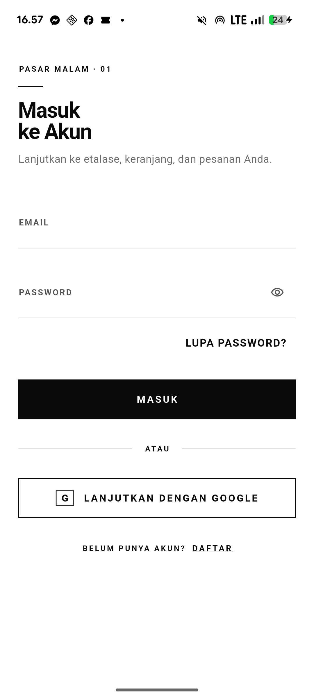 | 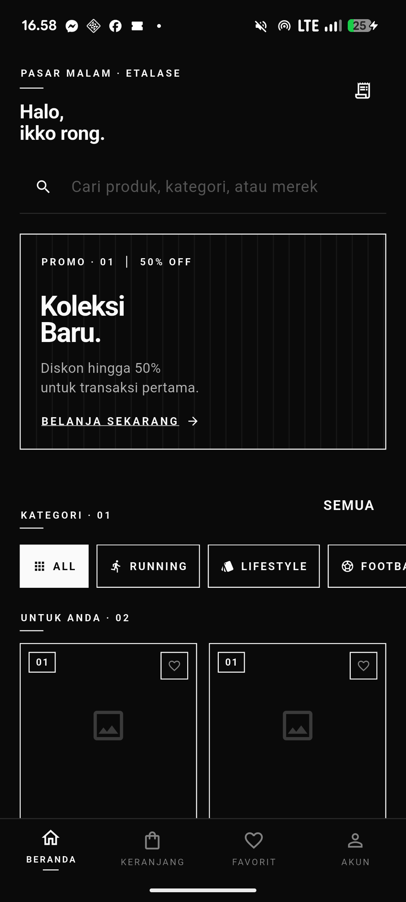 |
| 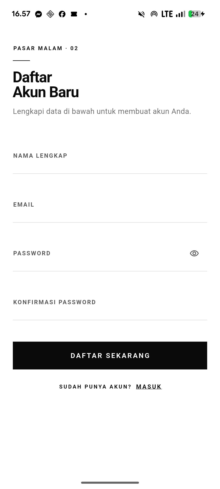 | 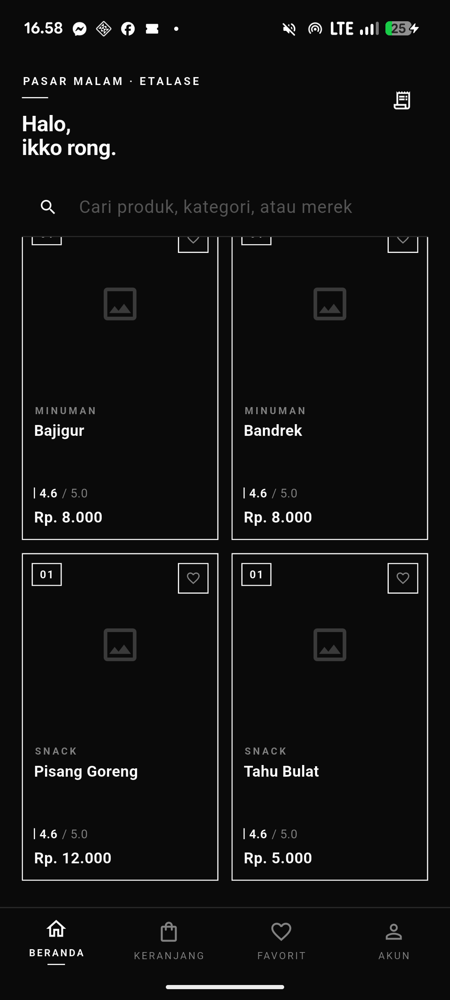 |
| 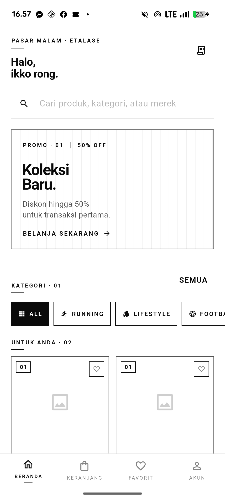 | 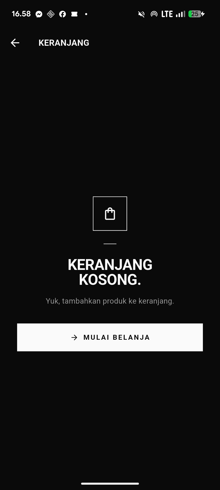 |
| 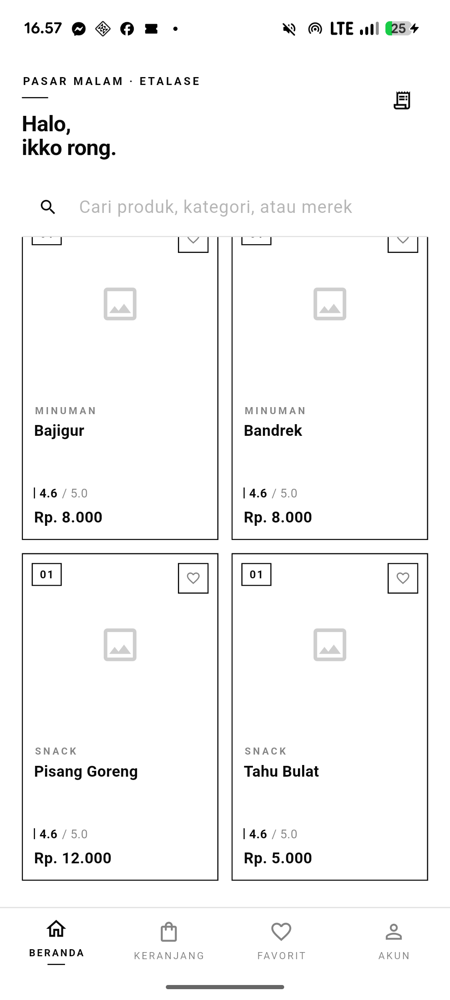 | 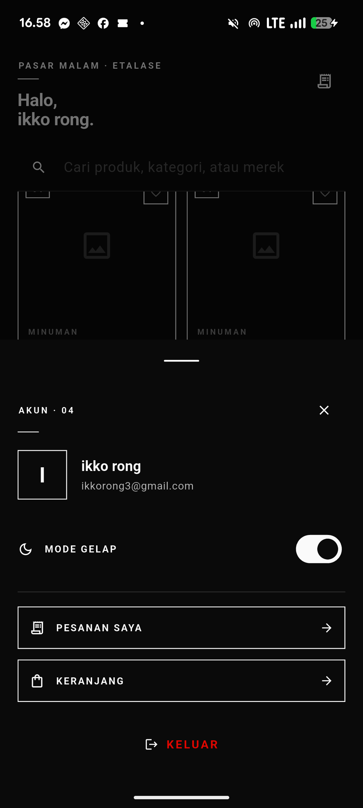 |
| 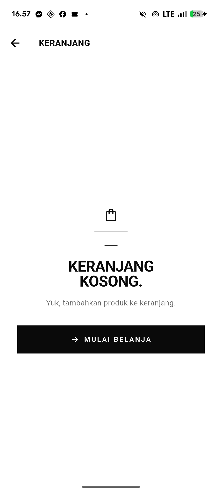 | |
| 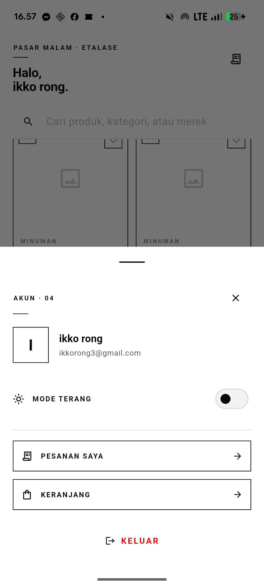 | |
| 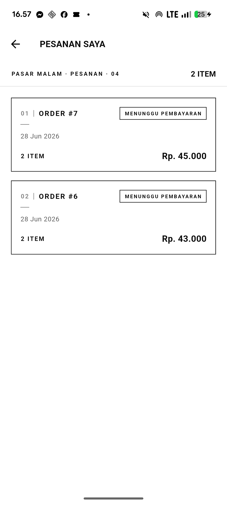 | |

## Fitur

### Autentikasi
- Login/Register pakai email + password lewat Firebase Auth
- Google Sign-In
- Verifikasi email setelah register
- Auth guard — halaman tertentu cuma bisa diakses kalau sudah login

### Dashboard & Produk
- List produk dengan filter kategori (Makanan, Minuman, Snack)
- Detail produk
- Pull to refresh
- Loading shimmer effect

### Keranjang Belanja
- Tambah produk ke keranjang
- Update jumlah item (+/-)
- Hapus item
- Lihat total harga
- Checkout dari keranjang

### Pesanan
- Checkout dengan pilih alamat pengiriman, catatan, dan metode pembayaran
- Lihat daftar pesanan (My Orders)
- Detail pesanan
- Status pembayaran (pending, sukses)
- Halaman khusus untuk pembayaran pending (VA number / GoPay deeplink)

### Fitur Tambahan
- Dark mode support (bisa di-toggle)
- Biometric lock — kunci aplikasi pakai fingerprint/face ID saat kembali dari background
- Push notification lewat Firebase Cloud Messaging
- Deep link handling

## Struktur Project

```
pasar_malam/
├── lib/
│   ├── core/                              # Core / shared modules
│   │   ├── constants/                     # API URL, warna, string
│   │   │   ├── api_constants.dart
│   │   │   ├── app_colors.dart
│   │   │   └── app_strings.dart
│   │   ├── providers/                     # Theme provider (dark mode)
│   │   │   └── theme_provider.dart
│   │   ├── routes/                        # Routing & navigasi
│   │   │   └── app_router.dart
│   │   ├── services/                      # Service layer
│   │   │   ├── dio_client.dart            # HTTP client setup
│   │   │   ├── secure_storage.dart        # Token storage
│   │   │   ├── notification_service.dart  # FCM handler
│   │   │   ├── biometric_lock_provider.dart
│   │   │   └── global_institute_pay_service.dart
│   │   ├── theme/                         # Theme data (light & dark)
│   │   │   └── app_theme.dart
│   │   └── widgets/                       # Shared widgets
│   │       ├── biometric_lock_screen.dart
│   │       └── swiss.dart
│   ├── features/                          # Feature modules
│   │   ├── auth/                          # Autentikasi
│   │   │   ├── data/models/               # Auth response model
│   │   │   ├── data/repositories/         # Auth repository impl
│   │   │   ├── domain/repositories/       # Auth repository interface
│   │   │   └── presentation/
│   │   │       ├── pages/                 # Login, Register, Verify Email
│   │   │       ├── providers/             # AuthProvider (state)
│   │   │       └── widgets/               # Button, text field, dll
│   │   ├── dashboard/                     # Produk & beranda
│   │   │   ├── data/models/               # Product model
│   │   │   ├── data/repositories/         # Product repository impl
│   │   │   ├── domain/repositories/       # Product repository interface
│   │   │   └── presentation/
│   │   │       ├── pages/                 # Dashboard page
│   │   │       └── providers/             # ProductProvider
│   │   ├── cart/                          # Keranjang
│   │   │   ├── data/models/               # Cart model
│   │   │   ├── data/repositories/         # Cart repository impl
│   │   │   ├── domain/repositories/       # Cart repository interface
│   │   │   └── presentation/
│   │   │       ├── pages/                 # Cart page
│   │   │       └── providers/             # CartProvider
│   │   └── order/                         # Pesanan
│   │       ├── data/models/               # Order model
│   │       ├── data/repositories/         # Order repository impl
│   │       ├── domain/repositories/       # Order repository interface
│   │       └── presentation/
│   │           ├── pages/                 # Checkout, My Orders, dll
│   │           └── providers/             # OrderProvider
│   ├── firebase_options.dart              # Konfigurasi Firebase
│   └── main.dart                          # Entry point
├── packages/
│   └── flutter_biometric_kit/             # Library biometric lokal
├── assets/
│   └── icons/
├── pubspec.yaml
└── README.md
```

## Tech Stack

| Komponen | Teknologi |
|----------|-----------|
| Framework | Flutter (Dart ≥3.11) |
| State Management | Provider |
| HTTP Client | Dio |
| Firebase | firebase_core, firebase_auth, firebase_messaging |
| Google Sign-In | google_sign_in |
| Local Storage | flutter_secure_storage |
| Notification | flutter_local_notifications |
| Biometric | flutter_biometric_kit (library lokal) |
| Deep Links | app_links |
| Other | email_validator, url_launcher, equatable |

## Halaman-halaman

| Route | Halaman | Keterangan |
|-------|---------|------------|
| `/` | Splash | Cek token, redirect otomatis |
| `/login` | Login | Email + password / Google Sign-In |
| `/register` | Register | Daftar akun baru |
| `/verify-email` | Verify Email | Verifikasi email |
| `/dashboard` | Dashboard | List produk, filter kategori |
| `/cart` | Keranjang | Isi keranjang belanja |
| `/checkout` | Checkout | Alamat, catatan, metode bayar |
| `/order-success` | Pesanan Berhasil | Konfirmasi order berhasil |
| `/my-orders` | Pesanan Saya | Daftar semua pesanan |
| `/payment-pending` | Pembayaran Pending | VA number / GoPay deeplink |

## Cara Menjalankan

### 1. Persiapan

Pastikan Flutter SDK sudah ter-install:
```bash
flutter doctor
```

Install dependencies:
```bash
flutter pub get
```

Konfigurasi Firebase: jalankan FlutterFire CLI buat generate `firebase_options.dart` sesuai project Firebase milikmu. Pilih app `com.example.pasar_malam` untuk Android dan `com.example.pasarMalam` untuk iOS.

### 2. Jalankan

Android:
```bash
flutter run -d android
```

iOS simulator:
```bash
flutter run -d ios
```

Lihat device yang tersedia:
```bash
flutter devices
```

### 3. Build

```bash
# Android APK
flutter build apk --debug

# iOS (simulator)
flutter build ios --simulator
```

### 4. Verifikasi kode

```bash
flutter analyze
flutter test
```

## Packages Lokal

Project ini punya satu package lokal di `packages/flutter_biometric_kit/` — library buat handle biometric authentication (fingerprint / face ID). Dipake buat mengunci aplikasi saat user pindah ke app lain, lalu butuh verifikasi biometric saat balik.

## Proyek Terkait

| Proyek | Link | Hubungan |
|--------|------|----------|
| `apk_pasar_malam_conect_dompet_digital` | [GitHub](https://github.com/Julianarwansah/apk_pasar_malam_conect_dompet_digital.git) | Pasar malam yang terkoneksi dengan dompet digital |
| `be_pasar_malam` | [GitHub](https://github.com/Julianarwansah/be_pasar_malam.git) | Backend API yang menyediakan data produk, keranjang, & pesanan |
| `Dompet_digital` | [GitHub](https://github.com/Julianarwansah/Dompet_digital.git) | Flutter app e-money — user bisa bayar pakai saldo dompet |
| `BE_Dompet_digital` | [GitHub](https://github.com/Julianarwansah/BE_Dompet_digital.git) | Backend dompet — share Firebase Auth dengan backend ini |

## Catatan

- Aplikasi butuh backend `be_pasar_malam` yang jalan supaya fitur produk, keranjang, dan pesanan bisa dipakai
- Biometric lock butuh device fisik (tidak jalan di emulator)
- Konfigurasi Firebase lama sudah dihapus, jadi harus generate ulang pakai FlutterFire CLI
- Dark mode bisa di-toggle dari halaman profil/pengaturan
